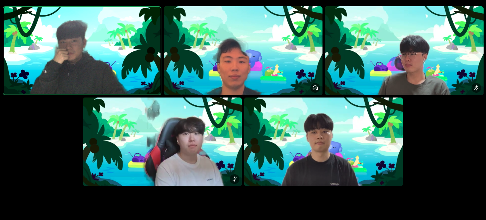

## 팀 구성원
- 가준영(팀장), 남의영, 왕종휘, 전병찬, 최수용
## 회고 내용 요약 (최소 500자 이상)

### 회고 주제 : `디자인 패턴`

> 💡 제일 자주 마주치는 디자인 패턴 3개
> - 싱글톤<br>
> - 템플릿 메서드 패턴<br>
> - 전략 패턴

```java
@Configuration
public class AppConfig {
		@Bean
    public DiscountPolicy discountPolicy(){
        return new RateDiscountPolicy();
    }
		@Bean
    public MemberRepository memberRepository(){
        return new MemoryMemberRepository();
    }
		@Bean
    public MemberService memberService(){
        return new MemberServiceImpl(memberRepository());
    }
		@Bean
    public OrderService orderService(){
        return new OrderServiceImpl(memberRepository(), discountPolicy());
    }
}

...

	
	public MemberRepository memberRepository(){
	if(이미 스프링 컨테이너에 등록이 되어있으면){
    	return 스프링 컨테이너에서 찾아서 반환;
    }else{
    	기존 로직을 호출하고 객체를 생성해 스프링 컨테이너에 등록
        return 객체 반환;
    }
```

### 싱글톤 패턴

```java
public class DatabaseConnector{
	private static DatabaseConnector INSTANCE;

    private DatabaseConnector(){}

    public static DatabaseConnector getInstance(){
    	if(INSTANCE == null){
        	INSTANCE = new DatabaseConnector();
        }
			return INSTANCE;
    }
}

public static void main(){
		DatabaseConnector con = DatabaseConnector.getInstance();
}
```

추가) 멀티 스레드 환경에서도 싱글톤을 보장하기 위해

```java
if(INSTANCE == null){
	synchronized(DatabaseConnector.class){
    	INSTANCE = new DatabaseConnector();
    }
}
```

### 템플릿 메서드 패턴

**Java**의 **창시자**인 제임스 고슬링이 한 인터뷰에서 내가 **자바**를 만들면서 가장 후회하는 일은 **상속**을 만든 점이다.
(코틀린은 기본적으로 클래스가 final)

```java
public abstract class Ramen {

    public void makeRamen() {
        boilWater();
        putNoodles();
        **putExtra();
        waitForMinutes();**
    }

    public void boilWater() {
        System.out.println("물을 끓인다.");
    }

    public void putNoodles() {
        System.out.println("면을 넣는다.");
    }

    public **abstract** void putExtra();

    public **abstract** void waitForMinutes();
}
```

```java
public class ShinRamen extends Ramen {

    @Override
    public void putExtra() {
        System.out.println("계란을 넣는다.");
    }

    @Override
    public void waitForMinutes() {
        System.out.println("4분 기다린다.");
    }
}

public class JinRamen extends Ramen {

    @Override
    public void putExtra() {
        System.out.println("콩나물을 넣는다.");
    }

    @Override
    public void waitForMinutes() {
        System.out.println("5분 기다린다.");
    }
}
```

```java
	public static void main(String[] args) {
        Ramen ramen = new ShinRamen();
				ramen.makeRamen();
    }
```

템플릿 메서드 : 훅을 사용하는 메서드
훅 : 미래에 자식들이 구현해야만 하는 제한된 책임 (추상메서드)

부모는 private으로 자식에게 감추는 건 감추고, 자식은 자신의 필드를 써서 로직을 구현한다. (super() 금지)

템플릿 메서드에서 자식은 부모를 알긴 하지만 부모에 대한 지식을 쓰면 안된다.
부모가 자식을 사용할 때 하나의 **프로토콜**로 보고 사용한다.

1:N의 관계에선 N이 1을 알게 하는 게 좋다. (만약 List<Item> 의 경우 한 객체가 모든 종류의 Item을 알아야 하기때문에 무겁다. 그렇기 때문에 단일 Item이 Holder를 알게 하는게 더 가볍다.)

상속에서는 N(자식)이 1(부모)를 알게 한다. (하나의 객체를 너무 많은 객체가 알고 있으면, 변경의 여파가 커진다. 상속은 그것을 의도한다.)
하지만 템플릿 메서드는 1(부모)가 1(프로토콜)을 알고있기 때문에 좋은 설계이다. (자식이 아무리 늘어나도 1:1 의 관계가 된다. )

### 전략패턴

전략패턴은 상속 (extends) 보다 구성(class fleid)에 의존한다.

상속은 단일 클래스만 확장할 수 있고, 컴파일 타임에 타입이 지정되므로 정적이다.이와 반대로 구성은 관계로 이루어져 있고 런타임에 동작을 변경할 수 있어 유연하다는 장점을 가지고 있다.

```java
public class OperationManager {

    private Strategy strategy;

    public void setStrategy(Strategy strategy) {
        this.strategy = strategy;
    }

    public int execute(int num1,int num2) {
        return this.strategy.execute(num1, num2);
    }
}

public interface Strategy {
    int execute(int num1, int num2);
}

public class Subtraction implements Strategy {
    @Override
    public int execute(int num1, int num2) {
        return num1- num2;
    }
}

public class Addition implements Strategy {
    @Override
    public int execute(int num1, int num2) {
        return num1 + num2;
    }
}
```

```java
	public static void main(String[] args) {
        OperationManager manager = new OperationManager();

        manager.setStrategy(new Addition());
        int result = manager.execute(1, 2);

        System.out.println("result = " + result);
    }
```

## 회고 과정에서 나왔던 질문 (최소 200자 이상)

### ✅ 이해 완료 리뷰
1. 자주 쓰이는 패턴들을 한번 더 상기시킬 수 있어서 좋았습니다. 예제 코드를 자세히 적어주셔서 이해하기 쉬웠습니다. 감사합니다!
2. 이게 뭐지?하고 들었네요. 신기햇습니다. 각 패턴간의 특징에 대해 잘 알수있었어요! 중간중간 헷갈리는게 자바개념이 부족한가 싶기도하고.. 부족함을 많이 느끼네요. 발표 잘들었습니다!
3. 템플릿 메소드 패턴, 전략 패턴 모두 많이 생소하지만 코드를 통해 잘 이해가 되었습니다! 아무래도 강제로 구현하게끔 만드는 점에서 좋지 않은 패턴인가 생각을 했는데 의외로 1:1 관계라 좋은 설계인게 생각보다 놀라웠습니다..! 좋은 정보 감사합니다! 수고하셨습니다~!
4. 패턴을 예시와 같이 들으니 이해가 깊히 되었습니다. 들어봤지만 활용할 수는 없는 패턴들이었는데 다음번에 패턴을 활용할 수 있을 것 같습니다

## 회고 인증샷 & 팀 자랑
> 저희 팀은 테코톡과 같은 방식으로 회고를 진행합니다.<br>
> 매주 금요일마다 2시간씩 잡아 모든 팀원이 발표를 하고,리뷰를 하는 형태로 진행합니다.<br>

